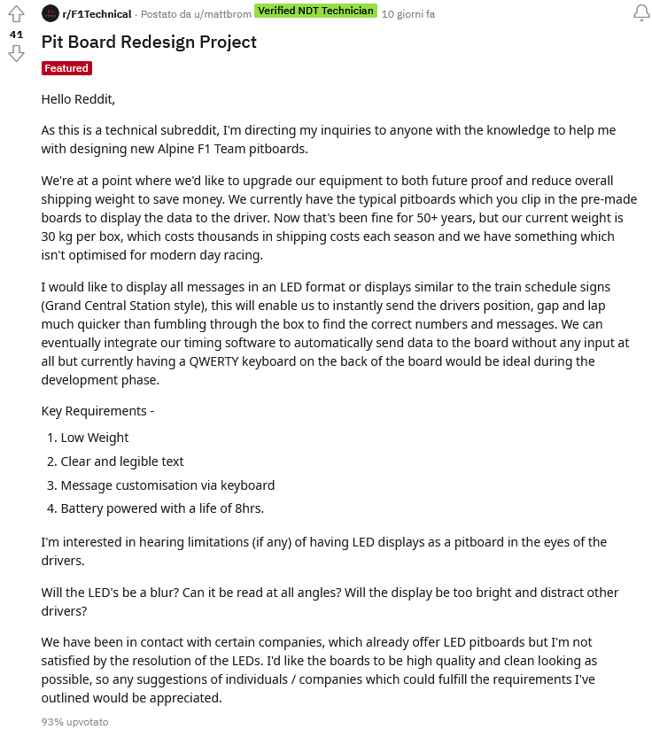
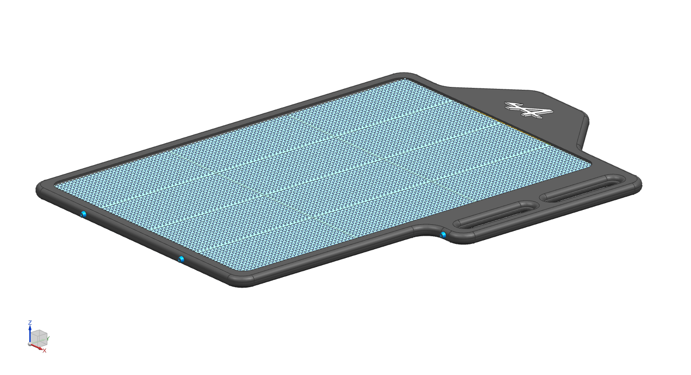
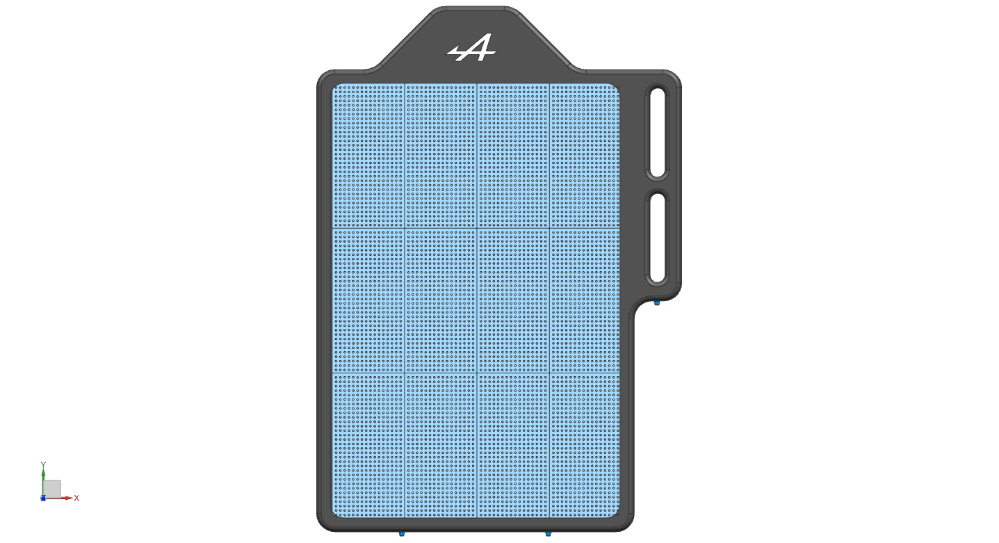
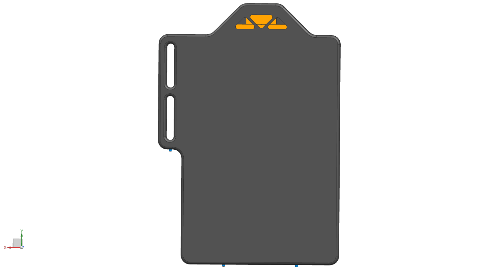
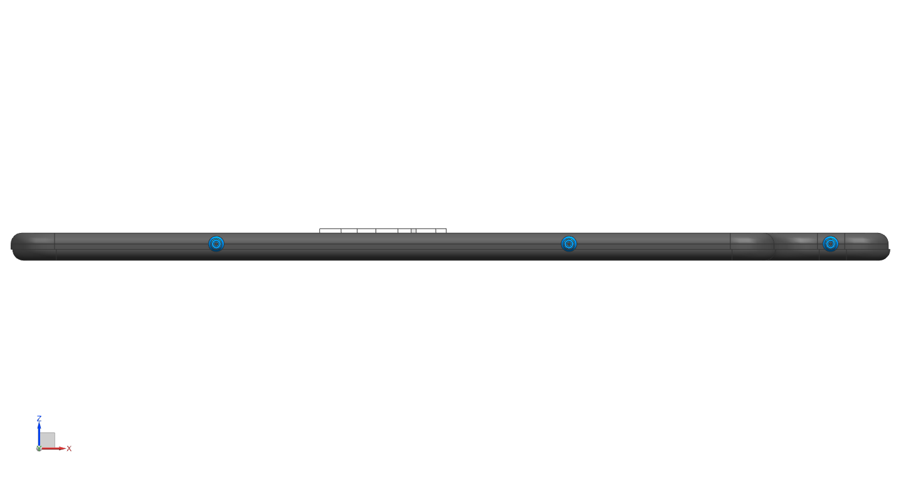
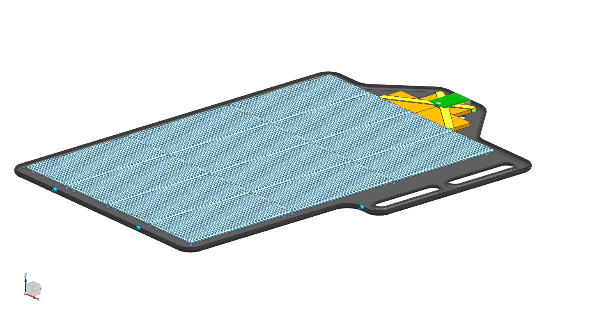
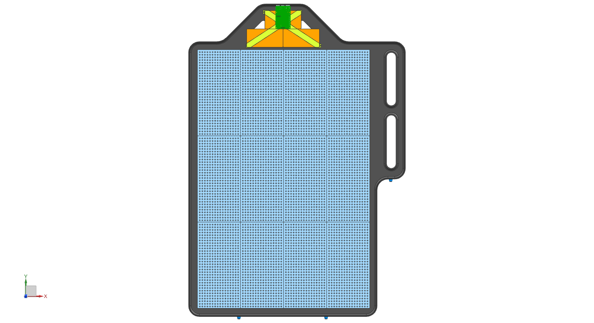

# pitBoard
F1 Digital Pit board for the Alpine F1 Race Team

Drafted over lunch because of time issues

## Why?
This Reddit thread started everything ([Link](https://www.reddit.com/r/F1Technical/comments/o7hek3/pit_board_redesign_project/))

## Requirements:
* Low Weight (<= 7kg)  

* Clear and legible text  

* Message customisation via keyboard  

* Battery powered with a life of 8hrs  

## How it looks like:

